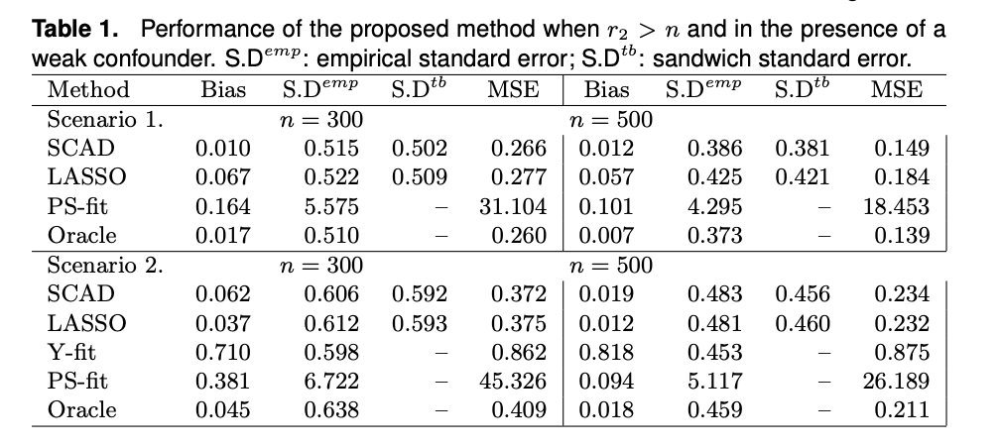

<!--

    colortheme: "owl"
    
    --> 

# Motivation 

- In small and moderate sample sizes common variable selection methods will lead to common issues

- Inclusion of spurious predictors can lead to inflated variance of the estimator 

- Omission of important confounders may lead to a biased estimation of ATE 

- Doubly robust estimators employ propensity score and outcome models to provide more credible estimates of ATE 

- Under the conditions that both types are correctly specified, variance of such estimator is also minimized 

# Overview  

- What if I told you there is a good method that addresses two common issues! 

- Proposed method aims to find non-ignorable confounders and predictors of outcome

- Intuitively, we shrink or remove the parameters based on how much the predictor contributes to the outcome model 

# Estimation

1. Consider all types of variables as predictors, construct outcome and treatment models with the same set of predictors. Variable selection is done using penalized joint maximum likelihood

2. Penalty for each coefficient depends on the levels of contribution to both the outcome and treatment models. Authors call this a booster parameter

    * For example, when a covariate that barely predicts the outcome and treatment it has a stronger penalty on the associated parameter. 
    
    * When a covariate barely predicts the outcome and is strongly related to treatment, penalty is less strict. 
    
    * Idea is similar to adaptive lasso 
    
# Estimation Continued 

3. Select final predictors with effects above a certain threshold: $\large \frac{1}{\sqrt{n}}$

4. Define $S_i = A_i - \pi(\textbf{X}_i)$, $\pi(\textbf{X}_i)$ comes from a refitted penalized regression 

5. Doubly robust estimator: $E[Y_i | S_i, \textbf{X}_i] = \theta * S_i + g(\textbf{X}_i, \beta)$
  * this one is similar to propensity score regression 
  
  * $\theta$ is the average treatment effect 
  
# Results 

* ATE compared to IPW and Outcome Regression with varying number of weak confounders 

* SCAD and LASSO used for considered method

# Questions 

\begin{align*}
\textbf{NO \ QUESTIONS}
\end{align*}
